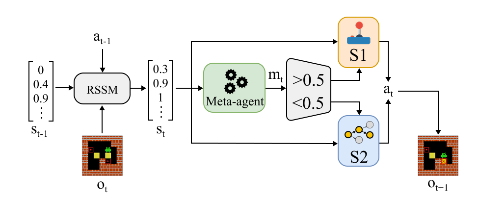
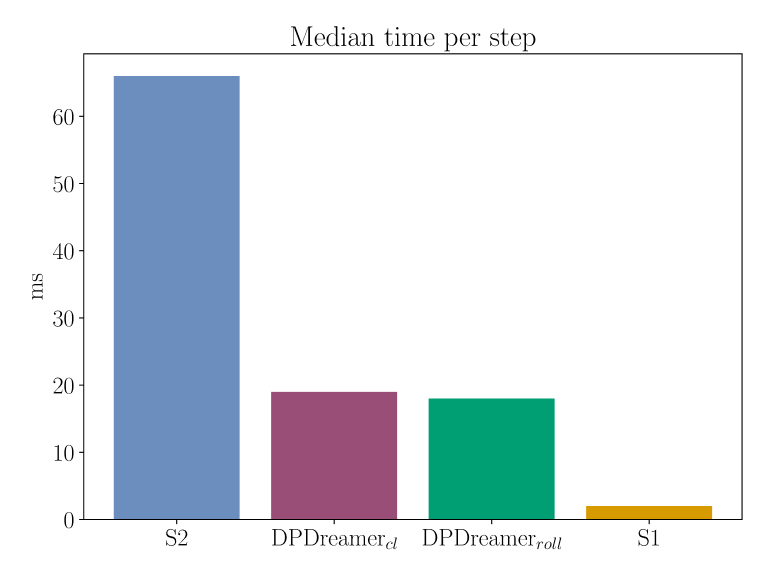
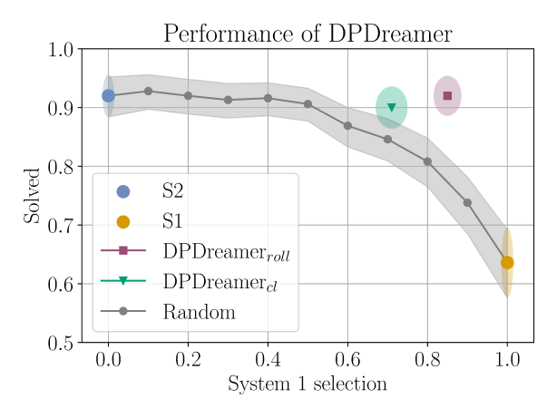

---

##### Download:

- [Paper](https://www.scitepress.org/Papers/2026/142432/142432.pdf)
- [Github](https://github.com/tobiaslo/DPDreamer)

---



##### TLDR

DPDreamer is a reinforcement learning architecture inspired by dual process theory (DPT) from cognitive psychology. The idea is that humans have two different thinking methods, one is intuitive and efficient, called System 1, and the other is slow and deliberate reasoning, called System 2. Depending on the situation, we can switch seamlessly between them.

Most AI agents rely on a single decision-making process, forcing a fixed tradeoff between speed and accuracy. DPDreamer addresses this by combining two systems: a fast RL policy network (System 1) for quick, efficient decisions, and a Monte Carlo Tree Search planning algorithm (System 2) for more careful, deliberate reasoning. These two systems are integrated together with a learned world model trained on the environment dynamics.

A "meta-agent" decides whether to use S1 or S2. In this paper, the meta-agent is trying to answer the question: “Is S1 able to solve the rest of the episode?” Depending on the answer, either S1 or S2 was chosen for the next step. We implemented two different versions, one rollout-based and one classifier based.

Tested on the puzzle game Sokoban, DPDreamer achieved a solve rate of around 90–92% — comparable to using the slow planner alone (92%) — while using the fast system over 70–85% of the time. This also translated to meaningful reductions in computation time on most boards. The meta-agents displayed human-like switching patterns, tending to use S2 at the start of complex puzzles before handing off to S1 once the situation became clearer.

---

##### Results

<div style="display:flex; gap:1rem;">
  
  
</div>

---

##### Citation

Author 1, Author 2. Year. "Title." *Journal* Volume (Issue): First page–Last page. https://doi.org/paper_doi.

```BibTeX
@article{AAYY,
author = {Author 1 and Author 2},
doi = {paper_doi},
journal = {Journal},
number = {Issue},
pages = {XXX--YYY},
title = {Title},
volume = {Volume},
year = {Year}}
```

---

